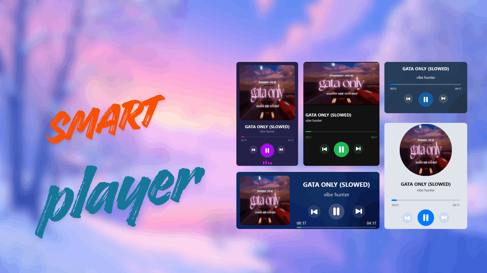

# SmartPlayer

A smart and fluent music player widget for your desktop, built for [Novadesk](https://novadesk.pages.dev/).



---

## Features

- 🎵 **Now Playing** — Displays current song title and artist in real time
- ⏯️ **Media Controls** — Play, Pause, Next, Previous buttons
- 📊 **Progress Bar** — Click to seek to any position in the track
- 🎨 **5 Unique Styles** — Choose from 5 beautiful visual themes to match your desktop
- 🔊 **Audio Visualizer** — Animated bars that react to your system's audio output
- 🪟 **Acrylic Blur Effect** — Frosted glass background using the BlurBehind addon
- ⚙️ **Configurable** — Scale and style options persist across sessions
- 🖱️ **Right-Click Context Menu** — Quickly switch styles (1–5) and scale (0.75x, 1x, 1.25x)

---

## Styles

| Style | Theme |
|-------|-------|
| **1** | Teal glassmorphism, horizontal layout |
| **2** | Dark Spotify-inspired, card with album art |
| **3** | Light/white theme with circular album art |
| **4** | Compact horizontal bar with cover art and controls |
| **5** | Deep navy/purple, full-featured vertical layout |

---

## Requirements

- [Novadesk](https://novadesk.pages.dev/) installed on your system
- Windows 10 or later (for Acrylic blur support)
- A media player that exposes **Now Playing** info via Windows media session (e.g., Spotify, Windows Media Player, VLC with SMTC plugin)

---

## Installation

1. Download `SmartPlayer_v1.0.0.0.ndpkg` from the [Releases](https://github.com/NSTechBytes/SmartPlayer/releases) page.
2. Double-click the `.ndpkg` file to install via Novadesk.
---

## Configuration

Settings are saved automatically in `config.json`:

```json
{
    "style": 1,
    "scale": 1
}
```

| Key     | Type   | Values             | Description                          |
|---------|--------|--------------------|--------------------------------------|
| `style` | number | `1` – `5`          | Visual style of the player           |
| `scale` | number | `0.75`, `1`, `1.25` | Scale multiplier for the widget size |

You can also change these live via the **right-click context menu** on the widget.

---

## Building from Source

Make sure nwm is available in your path that comes default with novadesk.
```bash
nwm build
```

Output files will be placed in `dist/`:
- `setup.exe` — Windows installer
- `SmartPlayer_v1.0.0.0.ndpkg` — Novadesk package
- `SmartPlayer_v1.0.0.0.zip` — Widget package

---

## Project Structure

```
SmartPlayer/
├── assets/
│   └── icon.ico              # Application icon
├── ui/
│   ├── assets/               # UI icons (Play, Pause, Next, Previous, Cover)
│   └── script.ui.js          # UI rendering and all 5 styles
├── config.json               # User configuration (style & scale)
├── index.js                  # Main script (media control, IPC, addons)
├── meta.json                 # Novadesk package metadata
└── defaultPreview.png        # Preview image
```

---

## Addons Used

| Addon          | Purpose                                      |
|----------------|----------------------------------------------|
| `nowplaying`   | Reads current media info from Windows SMTC   |
| `audiolevel`   | Captures audio output for the visualizer     |
| `blurbehind`   | Applies acrylic/frosted glass to the window  |

---

## License

This project is licensed under the Apache License. See [LICENSE](LICENSE) for details.

---

## Author

Made by **nstechbytes**
